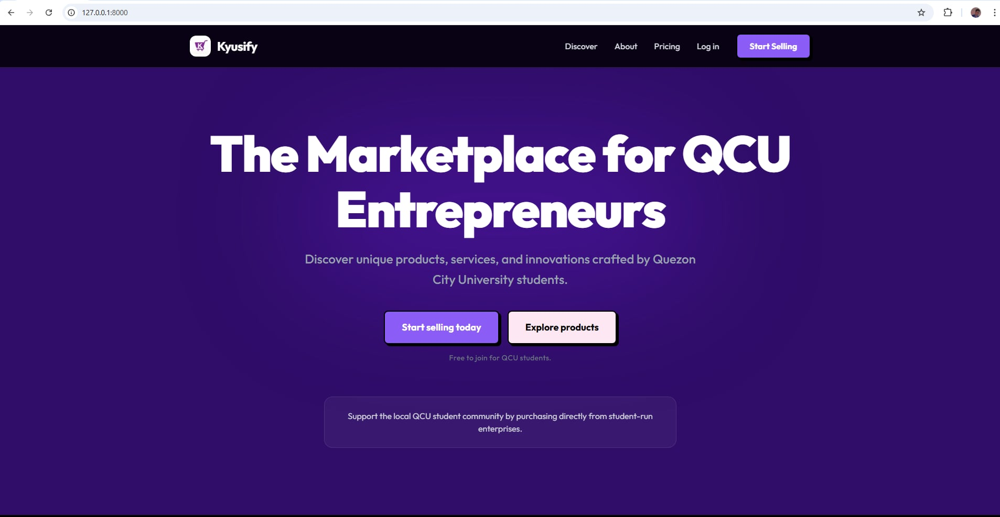
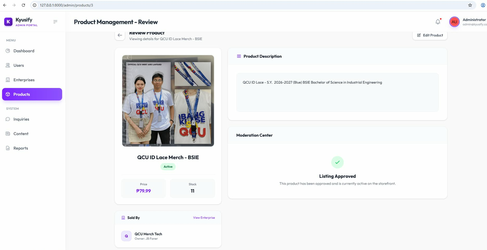
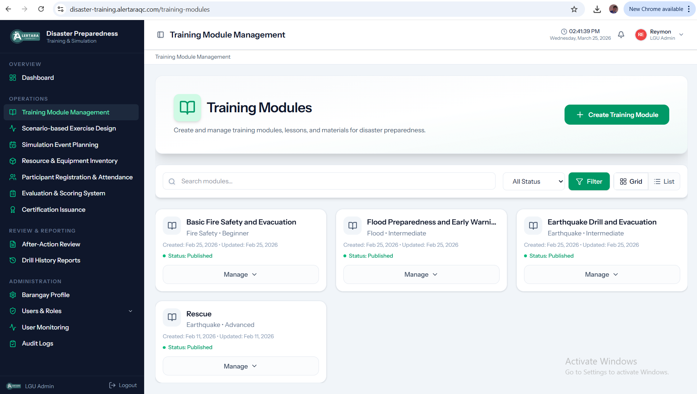
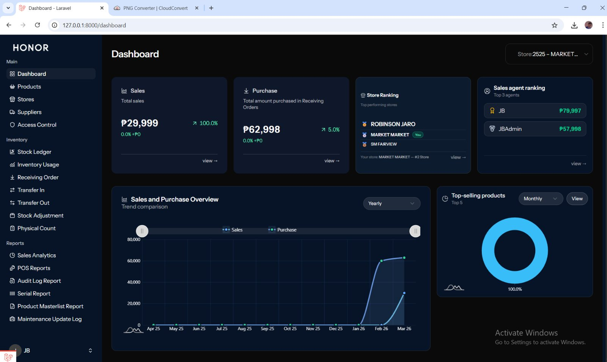
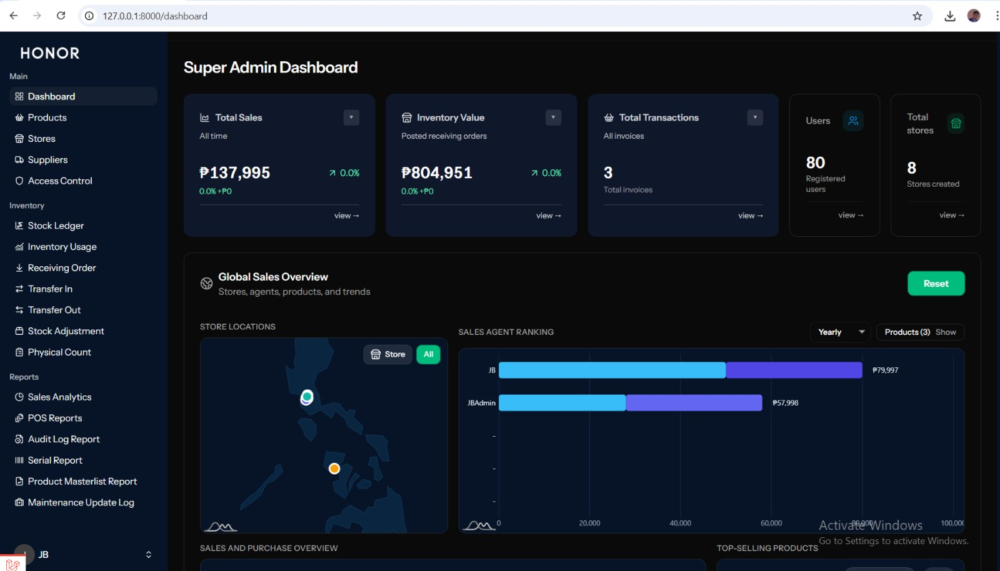

<div align="center">


<br/>

[](https://git.io/typing-svg)

<br/>

[](https://github.com/JBFaner)
[](https://github.com/JBFaner)
[](https://github.com/JBFaner?tab=repositories)

</div>

--

## 👤 About Me

```typescript
const JohnBenedict = {
  location:  "Philippines 🇵🇭",
  role:      "Full-Stack Developer & UI/UX Designer",
  building:  ["Full-stack web apps", "Clean UIs", "Scalable APIs"],
  databases: ["MariaDB", "MySQL", "HeidiSQL"],
  design:    ["Figma", "Canva", "Photoshop"],
  video:     ["Filmora", "CapCut"],
  contact:   ["jfaner7@gmail.com", "jbfaner8@gmail.com"],
  funFact:   "I turn coffee ☕ into clean, well-structured code.",
};
```

---

## 🧰 Tech & Creative Stack

### 💻 Languages

<p>
  
  
  
  
  
  
</p>

### ⚡ Frameworks & Libraries

<p align="center">
  
  
  
  
</p>

### 🗄️ Databases

<p align="center">
  
  
  
</p>

### 🎨 Design & Creative Tools

<p align="center">
  
  
  
  
</p>

### 🛠️ Tools & Platforms

<p align="center">
  
  
  
  
  
  
  
</p>

---

## 🚀 Featured Projects

---

### 🛍️ Kyusify — Student Enterprise Platform

> A centralized marketplace platform built for **Quezon City University (QCU)** student enterprises — transforming student-run businesses into accessible online stores where they can showcase products, manage listings, and interact with customers in real time.

**✨ Key Features**
- 🏪 **Multi-store marketplace** — Student enterprises register and manage their own storefronts
- 🛒 **Product discovery & browsing** — Categorized listings with search and filter support
- 💬 **In-store live chat** — Real-time customer-to-seller messaging per storefront
- 🛡️ **Admin portal** — Product moderation, enterprise management, user control & content management
- ⭐ **Store ratings** — Customer feedback and rating system per enterprise
- 📦 **Order & inventory tracking** — Stock management and product listing controls

**🔧 Tech Stack**


[](https://github.com/JBFaner/Kyusify---Student-Enterprise-Platform)

| Landing Page | Discover / Shop | Admin Portal |
|:---:|:---:|:---:|
|  |  |  |

---

### 🚨 Disaster Training Simulation — LGU Web App

> An LGU (Local Government Unit) web application built for **disaster preparedness training and simulation management**. It enables LGUs to plan, execute, and evaluate disaster preparedness drills with real participants, from training module creation to certification issuance.

**✨ Key Features**
- 📚 **Training Module Management** — Create and publish disaster preparedness lessons (Fire, Flood, Earthquake, Rescue)
- 🗓️ **Simulation Event Planning** — Schedule and manage scenario-based drills and exercises
- 📋 **Participant Registration & Attendance** — Track attendees per drill with sign-in management
- 📊 **Evaluation & Scoring System** — Score participants and generate after-action drill reports
- 🏅 **Certification Issuance** — Issue digital certificates to qualified participants
- 🗂️ **Resource & Equipment Inventory** — Manage disaster response resources per barangay
- 🔒 **Role-based access control** — LGU Admin, Barangay staff, and participant roles

**🔧 Tech Stack**


[](https://github.com/JBFaner/Disaster-Training-Simulation)

| Public Landing Page | Admin — Training Modules |
|:---:|:---:|
|  |  |

---

### 🏷️ Honor — POS & Inventory System *(Private Repo)*

> A modern, enterprise-grade **Point of Sale and Inventory Management System** built for Honor, a multi-branch retail business. Features a full sales workflow, real-time inventory tracking, multi-store management with an interactive Philippines store map, and advanced reporting — all in a sleek dark-mode UI.

**✨ Key Features**
- 🗺️ **Interactive Philippines Store Map** — Super Admin view with clickable store pins per location (amCharts 5)
- 🔐 **Permission-based route access** — Granular role & permission control via Spatie
- 🛒 **POS Sales Workflow** — Full checkout including serial/unit validation, sale, refund, and void
- 📅 **Shift-based Reporting** — X-Report and Z-Report per cashier shift with cash movement logs
- 📦 **Full Inventory Suite** — Stock Ledger, Receiving Orders, Transfer In/Out, Physical Count, Stock Adjustments
- 📊 **Analytics & Reports** — Sales analytics, agent ranking, store ranking, product masterlist & serial reports
- 🔑 **2FA / OTP Authentication** — Secure login with two-factor support
- 💳 **PayMongo Integration** — Online payment gateway integration

**🔧 Tech Stack**


> 🔒 *This is a private repository — screenshots are shared for portfolio purposes.*

| Store Dashboard | Super Admin + Philippines Map |
|:---:|:---:|
|  |  |

---

## 📊 GitHub Stats

<div align="center">


</div>

<div align="center">


</div>

<div align="center">


</div>

---

## 🏆 GitHub Trophies

<div align="center">


</div>

---

## 📬 Connect With Me

<div align="center">

[](mailto:jfaner7@gmail.com)
[](mailto:jbfaner8@gmail.com)
[](https://github.com/JBFaner)

</div>

---

<div align="center">


*⭐ If you find my work interesting, consider giving a star to my repos. Thank you!*

</div>
